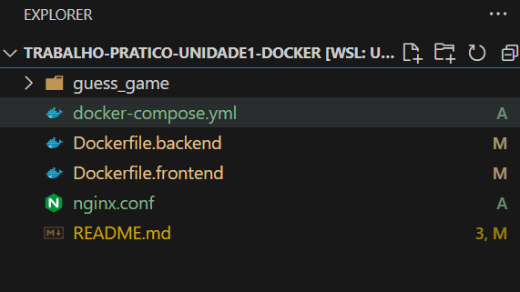
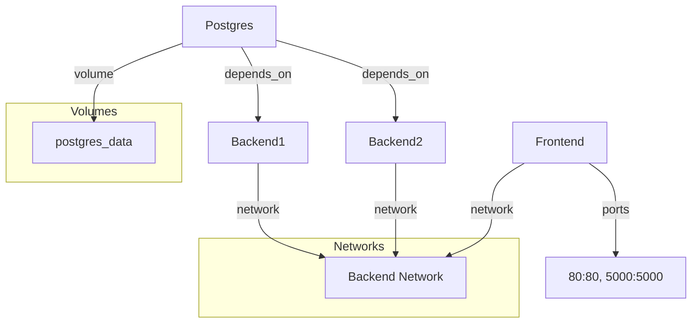
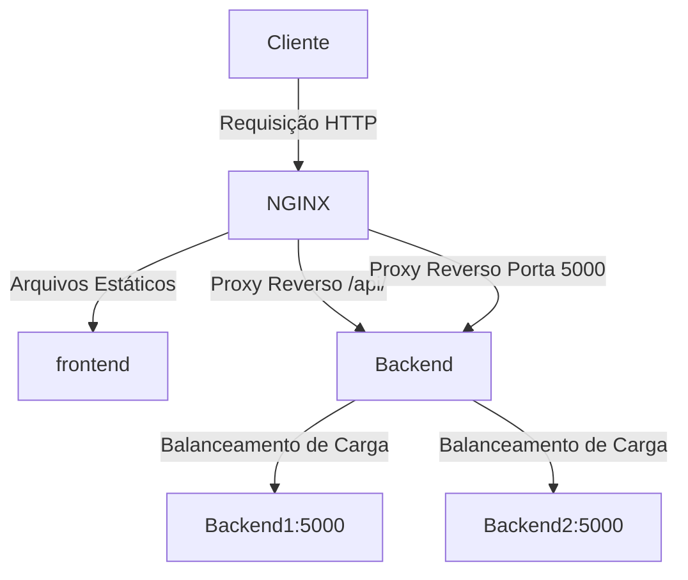

# Trabalho prático Unidade 1 Docker

## Orientações de uso

### 1. Clone o repositório do peojto alvo: guess_game

```sh
git clone https://github.com/fams/guess_game.git
```

**Obs.:** Clone o repositório no mesma pasta onde estão os arquivos docker*



### Comandos para Construir Cada Dockerfile

1. Construa a imagem Docker para o backend:

```sh
docker build -t backend:1.0.0 -f Dockerfile.backend .
```

2. Construa a imagem Docker para o frontend:

```sh
docker build -t frontend:1.0.0 -f Dockerfile.frontend .
```

## Passos para Rodar os Serviços - `docker-compose.yml`

1. Construa as imagens Docker para o backend e frontend usando os comandos fornecidos acima.

2. Inicie os serviços usando Docker Compose:

```sh
docker compose up -d
```

3. Verifique se os containers estão rodando:

```sh
docker ps
```

4. Verifique os logs dos containers para garantir que não há erros:

```sh
docker-compose logs
```

---

## Diagrama



### docker-compose.yml

Para facilitar a configuração de múltiplas instâncias do backend foi criado o bloco com variáveis de Ambiente de uso comum. `x-environment-backend`

**x-environment-backend:** Define um bloco de variáveis de ambiente comuns para os serviços backend. O `&default-backend-env` é um alias que pode ser referenciado em outros lugares do arquivo YAML.

```yml
x-environment-backend: &default-backend-env
  FLASK_APP: Define o nome do arquivo principal da aplicação Flask.
  FLASK_DB_TYPE: Define o tipo de banco de dados usado pela aplicação Flask.
  FLASK_DB_USER: Define o usuário do banco de dados.
  FLASK_DB_NAME: Define o nome do banco de dados.
  FLASK_DB_PASSWORD: Define a senha do banco de dados.
  FLASK_DB_HOST: Define o host do banco de dados.
  FLASK_DB_PORT: Define a porta do banco de dados.
```

#### Serviços que compõem a aplicação

##### 1. postgres

Define o serviço do banco de dados Postgres. Especifica a imagem Docker a ser usada para o serviço Postgres. Neste caso, a imagem postgres:17.0 é usada que pode ser alteraaada caso necessário.
O banco de dados Postgres deve ser armazenado em um volume persistente. Pois isso foi configurado volumes para persistência de dados.

postgres_data: Monta o volume postgres_data no diretório /var/lib/postgresql/data dentro do container.

A rede à qual o serviço Postgres está conectado é à rede backend-network.

restart: always: Define a política de reinício para o serviço. O container será reiniciado automaticamente se falhar.

##### 2. Serviços backend1 e backend2

backend1 e backend2: Definem os serviços backend.

* image: Especifica a imagem Docker a ser usada para o serviço backend. Neste caso, a imagem backend:1.0.0 é usada.
* environment: Define as variáveis de ambiente específicas para o serviço backend, reutilizando o bloco default-backend-env.

* depends_on: Define a dependência do serviço backend no serviço Postgres. O serviço backend será * iniciado somente após o serviço Postgres estar em execução.
* networks: Define as redes às quais o serviço backend está conectado.
* backend-network: Conecta o serviço à rede backend-network.
* restart: always: Define a política de reinício para o serviço. O container será reiniciado automaticamente se falhar.

##### 3. Serviço frontend

* image: Especifica a imagem Docker a ser usada para o serviço frontend. Neste caso, a imagem frontend:1.0.0 é usada.
* ports: Define o mapeamento de portas entre o host e o container.
* networks: Define as redes às quais o serviço frontend está conectado.
* backend-network: Conecta o serviço à rede backend-network.
* restart: always: Define a política de reinício para o serviço. O container será reiniciado automaticamente se falhar.

### Atualização de Componentes

Para atualizar um componente específico, basta alterar a versão da imagem no arquivo docker-compose.yml e reiniciar os serviços:

1. Atualize a versão da imagem no arquivo `docker-compose.yml`:

```yaml
backend1:
  image: backend:1.1.0  # Nova versão da imagem do backend
```

2. Reinicie os serviços usando Docker Compose:

```sh
docker-compose up -d
```

Isso garantirá que você possa atualizar qualquer componente (backend, frontend, banco de dados) apenas trocando a versão da imagem correspondente no arquivo `docker-compose.yml`.

---

## Estratégia de balanceamento de carga

O NGINX atua como proxy reverso para as requisições que começam com /api/, encaminhando-as para o grupo de servidores backend (backend1 e backend2), balanceando a carga entre eles.

### Diagrama

Aqui está um diagrama Mermaid que representa a configuração:



---
